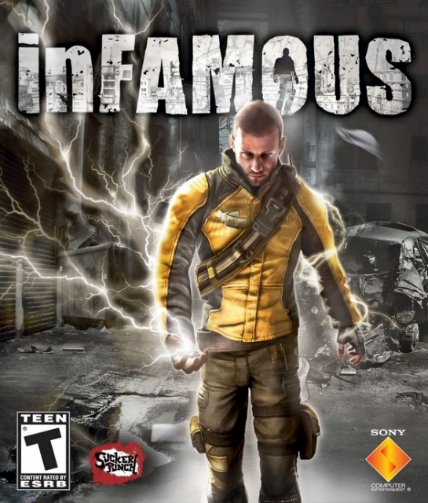
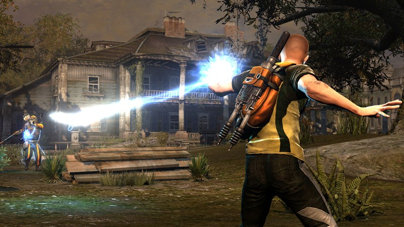

I haven’t written a review (or indeed anything) on the blog for a while as I have been concentrating my written output on [Easy Ear Training](http://www.easyeartraining.com/), but I recently completed Infamous on the PS3 and got to thinking that it was an awesome game with a few flaws which is the most interesting kind of game to review. Couple that with the fact that it is featured in Sony’s new Playstation Plus promotion and Infamous 2 is on the way and I figured it was ripe for some comments.
##The Plot
I guess if you are reading this you probably have an idea of the plot, but for those of you that don’t you play the part of Cole a courier who has suffered the inconvenience of having the package he was delivering explode destroying half the city and equipping him with super powers. He awakens some time later in a city which has been quarantined by the government and taken over by violent super powered gangs. The city is roughly based on Manhattan and is split into three islands which become available as the game progresses. Playing as our hero you must kick vast amounts of ass in a third person, open world, shooter, come parkour influenced platformer where you complete story missions and optional side missions indicated by flags on the map. “Wait a darned minute” you quite rightly say. Isn’t that like just about every other game I’ve played for the last five years?  
Well pretty much, but there’s a twist. Cole has power over electricity but he doesn’t generate it himself he is instead reliant on the power grid of the city for his powers. Initially armed with a peashooter lightning bolt charging yourself up from overhead power lines, generators and streetlights heals you and grants you access to all manner of additional powers such as lightning grenades and force fields. The only thing that stands in your way of a baddy zapping party time is the unfortunate fact that most of the cities grid has been knocked out in the explosion. Arriving on an island for the first time you are presented with violent gangs on every street corner and no power to juice yourself up with. Many of the main quests revolve around restoring the cities infrastructure by locating fixing substations. This is a very cool element of play as the increasing power in the grid provides a very natural way to grant the player new and awesome powers like surfing on power lines or gliding on static which are usually required from that point on to complete missions. 
##Side Quests

The side quests tackle the gang side of the equation. Each mission is given to you by a needy member of the public and completing it marks that area of the map as your territory meaning enemies are less likely to appear there. This is a cool game mechanic, but has one obvious downside. When you get to a new location you are well and truly under the cosh with bullets coming from rooftops all around and few opportunities to recharge, but as you complete missions you become stronger, face less opposition and are never more than a few meters away from life giving power meaning on medium difficulty you can pretty much just stand in the open wailing on your enemies and slurping up street lights as soon as you get shot. This means that the difficulty level is somewhat uneven and even worse once you have completed the game there are so few enemies around it becomes difficult to even find enough targets to practice trophy winning “stunt” kills on. This is made up for by the fact that it is undoubtedly fun to be Cole. You feel pretty bad ass at the start, but by the end once you have unlocked all the powers and upgraded them with the XP you earn for most actions you are a one man army. Tossing people around like rag dolls and blowing up cars and petrol stations with gay abandon. Moving through the city also feels great. You need to get up high to get around without being sniped and the parkour come power line surfing mechanic makes you feel like a cross between Spiderman and Silver Surfer. Unusually for a third person game the camera is nearly always where you want it and jumping into an abyss by mistake is a rarity. The control scheme feels natural and the only real downer is that the combination of a Gears Of War-esque cover mechanic and acrobatic platforming means that often when you are racing away from a hand grenade you will inexplicably stick to a wall and meet a messy death.  
The side missions should be singled out for special praise they feel like a part of the core experience rather than a tack on and encompass: Taking prisoners to jail, treasure hunts, rooftop races, protecting citizens, solving murders, deactivating surveillance devices and fixing trains. So much better than the go to place x, shoot 5 guys and collect Maguffin y, repeat until coma that many games think is acceptable.
##Morality Bites
So far I haven’t touched on the morality mechanic that gives Infamous it’s title and that’s with good reason as I feel it adds pretty much nothing to the game. Blowing up half the city has made Cole public enemy number one and you can choose to use your powers either to change the mind of the populace and become a hero or punish those who rejected you and become Infamous. This mostly manifests it’s self as nothing more than morality based quick time events where you press “X” for good or “O” for bad action, you don’t even have to work it out for your self as a handy red blue chart appears on screen. In addition to this various actions like killing or healing members of the public has a cumulative effect. It would be cool if the decisions were worth a moment of your time, but once you have taken your first good or bad step you would have to be an idiot not to take the same course with every successive action. Extremes of status grant new powers so trying to act in a “realistic” fashion and alternating means you miss out on all the optional powers. This means that far from being a complex game of morality it is simply a linear game that you can play through twice should you wish to. The net result of your morality choice is a handful of mutually exclusive good or bad side missions on each island and two optional powers one of which I didn’t ever use and the other of which is fairly similar regardless of which side you get it from. At several points the game gives the illusion that your actions are having a significant impact on the plot, but on a second play through you will discover that regardless of the decision the game contrives to provide virtually the same outcome.  
The final moan is that the game crashed a couple of times and you may find your self sinking through more complex terrain due to some dodgy collision detection.  
##Fun despite the flaws
When it comes down to it Infamous is a lot of fun and I enjoyed playing it all the way to the end though it didn’t offer enough for me to want to start again with an evil play through.  
If they can fix the few annoyances that stopped this from being a true world class game then Infamous 2 is going to be an absolute riot.