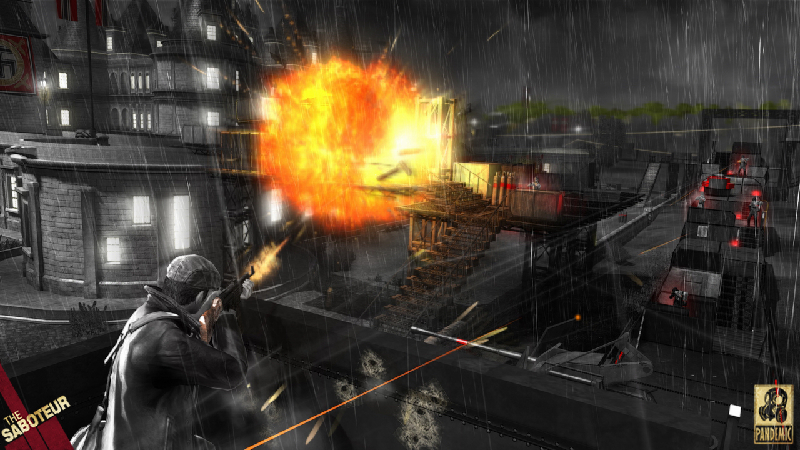

    
I'm not too picky with games. I have a Lovefilm subscription and due to the <a href="http://tvtropes.org/pmwiki/pmwiki.php/Main/FourPointScale" target="_blank">four point scale</a> it's pretty much impossible to trust game reviews (with the possible exception of Ars and Edge) so I just tend to rent anything that looks interesting and send it back when I get bored. Sometimes I can't stand a game that everyone raves about (Modern Warfare 2) and occasionally I rather enjoy something that's generally considered to be junk (Excite Truck).

##Space Invaders with Swastikas 
Despite having read dozens of books on WWII there have been no games on the subject that I have enjoyed as they all seem to side step the reality of war and degenerate into Space Invaders with swastikas.

The last game I rented was The Saboteur; Pandemic's swan song before going belly up. It's a fantastic concept for a game. Set in occupied Paris during WWII and loosely based on the real life story of <a href="http://en.wikipedia.org/wiki/William_Grover-Williams" target="_blank">William Grover-Williams</a> winner of the first Monaco Grand Prix turned French resistance war hero. Perhaps this would be the first true war game. Unfortunately the game is so spectacularly mishandled it's reminds me of the episode of The Simpsons where Homer <a href="http://en.wikipedia.org/wiki/Beyond_Blunderdome" target="_blank">rewrites Mr Smith Goes to Washington as a bloodbath shootout</a>. 
 
For no apparent reason the protagonist has been changed into a horrific Irish stereotype (genuine sample dialogue: &#8220;OIM BLOODY OIRISH!) who's only interests are drinking, smoking and shagging. Worst of all he openly doesn't give a toss about the plight of the French under the Nazis and is only fighting to get revenge on a German solider who killed his friend after they tried to steal his car in a tit for for tat dispute over a fixed race (I'm not kidding).

Not only is the main character a misogynistic. homophobic moral vacuum who lives in a brothel (complete with premium DLC to add computer boobies) the voice acting, plot and script are risible with accents that would make the cast of Allo Allo blush. The plot is so muddled that in 1940 the war doesn't seem to have started but three months later, the Nazis seem to have invented Nuclear Weapons, have highly advanced radar systems, conquered France (and rebuilt half of it)  and the French resistance is in full swing. 

All this and more is summed up nicely in Keza MacDonald's opinion piece for Eurogamer <a href="http://www.eurogamer.net/articles/2010-11-30-why-i-hate-the-saboteur-opinion?page=1" target="_blank">&#8220;Why I Hate&#8230; The Saboteur&#8221;</a> (so I'm not going to talk any more about how offensive the plot is) which really got me thinking if it's so terrible, why was I half way through it and why did I complete it last night?

##Game Mechanic Bingo
It certainly isn't because of the focussed game play. At various points The Saboteur continually switches between third person shooter, stealth, racing game, parkour platformer, demolition sim and Nazi themed GTA. You can imagine someone at Insomniac pitching it as Metal Gear Solid meets Gran Turismo, meets Assassins Creed, meets Gears of War, meets Red Faction.

This unfortunately results in nothing being done very well. Despite playing a racing driver you only get to take part in five races in the whole game which aren't all that much fun (Imagine a racing game based on the GTA engine). Worse still stealth games rely on the guards being much stronger than you, but the shooter parts result in our hero having huge amounts of regenerating health and vast amounts of fire power so upon discovery you can often just run down the machine gun fire for a one hit neck break for a free Gestapo uniform shaped ticket back to stealth mode. 

The stealth model its self is somewhat broken relying on what is called a zone of suspicion which shows up on your map around Nazi property and locations of explosions or gunfire. This means the following are all possible: Driving a car down a busy road into a fuel dump but jumping out before the zone of suspicion will not register as a suspicious event, when walking up to a guard tower the lookout will loose interest when you are underneath because he can't see you meaning you can always blow them up in complete safety, and after driving a tank into a base and blowing most of it sky high you can jump out and switch off the alarm and everyone will assume it was a false alarm and go about their business despite half of the base being on fire. 

The map is so vast and so filled with German hardware and troops it seems like an impossible task to defeat them, but as on death anything you destroy stays that way and you always start at the nearest gun shop you quickly realise the war of attrition is in the other direction. A fool proof technique is to stock up on rockets, drive a car straight through the front gates of fortress blow up everything in sight, die wake up at the gun shop rinse and repeat. 
 
There are almost too many silly things list like the fact that there are no consequences of driving a car into civilians, or a wall at 100mph, or that in Germany everyone is still French and on your side, or the controls which share the same button for detonate and shoot making it easy to execute the perfect stealth sabotage then  randomly fire into the air in a room full of Nazis if you hold the button a microsecond too long, and worst crime of all the grenade button mapped to the (hair) trigger meaning you blow yourself up if you ever put the controller down without pausing.

So what's good about it?

##The Joy Of Blowing Things Up

The first and most obvious thing is that blowing stuff up is fun. Covertly planting dynamite on tanks and anti-aircraft guns then watching your handy work as bits of burning metal ascend into the sky never really gets old and there's an awful lot of stuff to blow up. Gunplay is also solid and enjoyable with a good range of weapons on hand. 

##Paris J'Taime
The real star of the show in this game is Paris. The city and surrounding countryside are lovingly rendered and you are often met by breathtaking cityscapes complete with iconic Parisian landmarks (Although it does have the amusing Team America tendency to put the Eiffel Tower and Arc de Triumph right next to each other). Much has been made of the novel mechanic where the sense of hope in the populace is reflected with colour. Areas under German control are rendered in black and white with the only splashes of colour the red of blood, fire and Nazi symbols while areas in which the resistance have a foothold are in vivid colour. The game engine is solid and has <a href="http://www.eurogamer.net/articles/digitalfoundry-saboteur-aa-blog-entry">some clever anti-aliasing</a> on the PS3 which keep everything looking smooth not to mention it is one of the only action games I've played recently that hasn't crashed at the drop of a hat.

The sound track is also inspired with some excellent jazz tracks including Caravan and Feeling Good featuring extensively. 

I can't help imagining the turtle neck wearing art department despairing as the high fiving frat boys in the gameplay department filled their loving crafted city with strippers, cartoon Nazis. &#8220;Sweet Jumps&#8221; and a main character who will commit murder for a case of booze (I'm not kidding)

##So Close and yet So Crass
All in all this game feels like a wasted opportunity. If the management at Pandemic had picked one or two gameplay mechanics and stuck to them the action could be much tighter and more fun. 

The second and more significant improvement would have been to send the entire script and voice teams on a day out and then move offices while they were away. It's a rare example of a game that could be remade without changing the engine, or graphics and easily be double the game with with the kind of charm and charisma displayed by the story teams at studios like Naughty Dog or Rockstar.

As it stands the best way to enjoy this game is to rent it and skip the cut scenes.  
