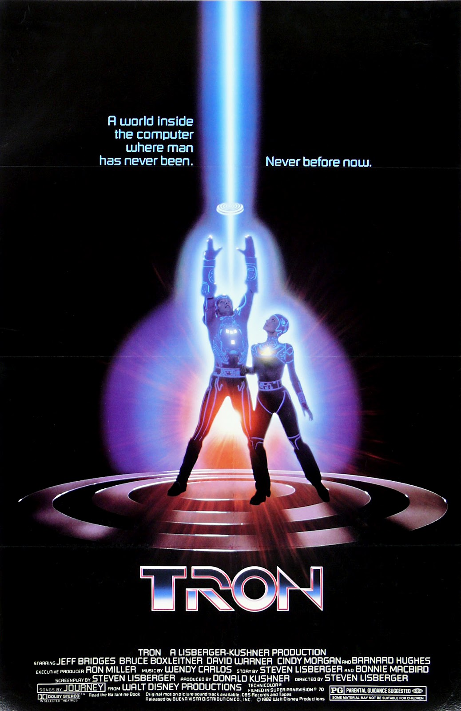

  
  
  Spotify have had a preview sampler of the Daft Punk soundtrack for the Tron Legacy movie for the last couple of weeks and since the full version has come out I have listened to very little else. It is a glorious, electro orchestral tour de force. I can't think of many more perfect pairings for a film soundtrack and I'm impressed that Disney have had the stones and the vision to hand a triple A blockbuster to a couple of French guys who think they are robots. It bodes very well for the movie which I still fully expect to be impressive nonsense, but at least now it might be <i>stylish </i>impressive nonsense<i>.</i>
  
  Check out this trailer featuring stand out track Derezzed 
  
  [listen to it on Spotify](http://open.spotify.com/album/2GC8kfyiyPjyheUUWyEY8F)
 
##Rotoscoped Insanity
  
 
  
 
  I'm a huge fan of the Rotoscoped insanity that is the origional Tron. It's a little bit all over the place, but I think alongside War Games it really stands up as one of the greatest geek films of all time. I can watch the primitive CGI scenes over and over again, but I love the neon glow most of all (which few people even to this day realise was painstakingly <a href="http://en.wikipedia.org/wiki/Rotoscoping">rotoscoped</a> by hand).  
  
  A weak point of the film was probably the Wendy Carlos soundtrack. It was quite reasonable to assume that the menacing synth work of Clockwork Orange might be carried across, but to me the soundtrack sits awkwardly and is quite conventional and in places cheesy. 
  
  Even if Tron Legacy is a stinker the soundtrack will still take it's rightful place in my heart alongside the greatest sci-fi sound track of all time the <a href="http://open.spotify.com/album/7pBQXFZtCyWohZlNQMieQ2">Vangelis soundtrack for Blade Runner</a>.
  