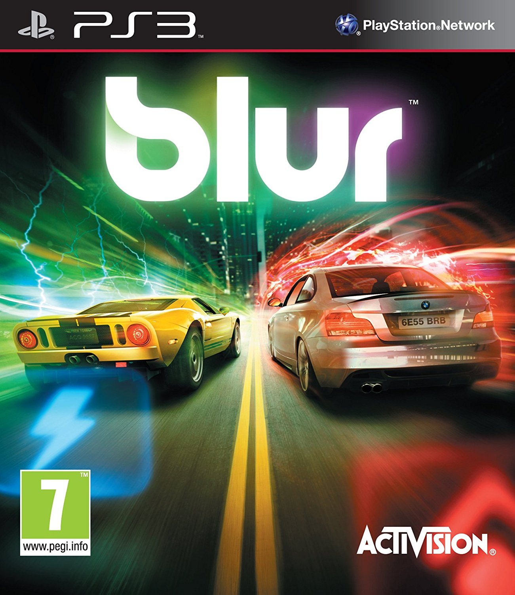

 
  
  
I received Blur today from Love Film. I had high hopes, but unfortunately it was one of those games that was in the console for about half an hour before it was back in the envelope ready to be posted back.
   
  
  
The concept of the game can be summed up very simply, it's Burnout crossed with Mario Kart (or if you prefer Wipeout with cars). You race around stylised tracks in real cars with arcadey physics whilst picking up various power ups that fling balls of glowing energy into your opponents. The graphics and presentation are very impressive, but ultimately the game just isn't fun. 
   
  
  
Combining the two genres of cartoony Kart game and arcade adrenaline racer must have seemed like a winner on paper, but they are fundamentally incompatible genres. In Mario Kart the unrealistic physics of the tiny nimble cars allows you to dodge your opponents shells and makes targeting tricky, but a game like Burnout is all about the feeling of weight. A great arcade racer gives you the impression you are hauling tonnes of protesting steel teetering on the limits of traction moments from disaster. The upshot of this dysfunctional marriage of genres is that in Pure with it's large unwieldy muscle cars it is trivial to hit and virtually impossible to avoid being hit. When 20 cars are participating in a race armed with a near limitless supply of homing missiles and leader zapping lightning you might as well call it <a href="http://www.mariowiki.com/Spiny_Shell_(Mario_Kart_Item)">blue shell</a> the game.
   
  
  
As is par for the course in such games you start at the back of the pack and have the benefit of being slightly faster than your opponents. Making your way to the front requires little more than not crashing for a couple of laps and once you are there it's simply a matter of luck if you will get zapped on the last corner and end up finishing in 10th place. It's not just that when you fail it feels like a cheap loss you also start to feel that victory is equally random and thus hollow. 
   
  
  

   
  
  
Checking <a href="http://www.metacritic.com/game/playstation-3/blur">Metacritic</a> it looks like Blur got some pretty solid reviews, but I wonder how much that was a result of Activision leaning on the press as by all accounts the game tanked at retail leading to the Bizarre Creations eventual demise last month. My heart goes out to all the guys facing redundancy as you can tell a lot of love went into the making of a game which ultimately doesn't really work. Bizarre will always have a special place in my heart as quite apart from their stand out hits Project Gotham and Geometry Wars the studio's first ever game was The Killing Game Show an Amiga classic which I loved as a kid. 
   

  
  
  
