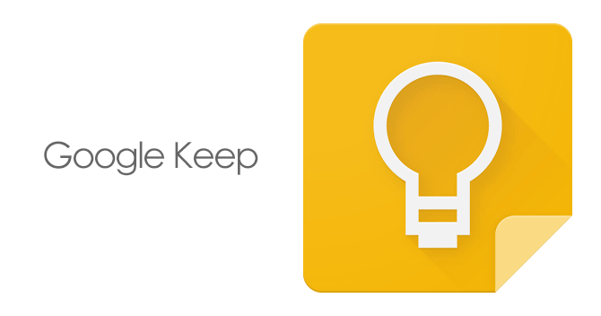

 

This week Google announced Keep a free online note taking product to rival Evernote which I will not be using.

I'm an avid premium Evernote user, but I haven't always been. Back in 2006 I was introduced to the world of online note taking by a free online note taking app called Notebook made by a company called Google. I used to fill these notebooks with interesting things I'd found using my favorite feed reader also provided by Google and sometimes if really liked a news feed I'd pin it to the front of my iGoogle homepage.

## Nothing but a G Thang

You might go so far as to call me a Google fan boy. I have used GMail and Docs since it was invite only, I have an Android phone and tablet. I'm even writing this article via Chrome.

The reason I use so many Google services is that they are so frequently an unassailable combination of the best product at the best price which is as we all know is free, or is it?

## At What Price Free?

I used to write this blog on a site called Posterous which was a really great platform with the nice twist of allowing you to blog by e-mailing them whereupon lots of clever code would format your ramblings into a nice looking blog post. Like many web start ups Posterous apparently had no business model whatsoever. In the face of this they did what all startups want to do and got bought by one of the big boys. In this instance Twitter who promptly shut them down.

Last week we discover that Reader (and iGoogle) are also to be shutdown and I find my self looking for a replacement in a marketplace that has stagnated due to a free product completely wiping out the competition and then disappearing in a waft of corporate bullshit about &#8220;focus&#8221;. Google are nothing like Posterous in that they are clearly very good at making money, but the situation is identical. I don't pay Google for Reader or Posterous for my blog so they can take it away if they so choose because I'm not the customer.

I shouldn't be surprised after all as I mentioned in the first paragraph I was an avid fan of Notebook which died in 2011. Indeed [this excellent Guardian article](http://www.guardian.co.uk/technology/2013/mar/22/google-keep-services-closed) suggests Google services have an average life expectancy of about four years.

## Feedly Falls Flat

Hunting around for a new provider for my Reader I saw a great number of recommendations for Feedly. Pretty as this site undoubtedly is (I do have some technical misgivings I shall share in a future post) I can't bring myself to use it because it offers no obvious business model and currently lacks a premium offering. This means that at some point in the future they are going to start charging an as yet unknown amount, or will shut down through acquisition, or just burning though their VP money.

As a consequence I've decided to selfhost my blog using WordPress and my RSS needs using [Tiny Tiny RSS](http://tt-rss.org/redmine/projects/tt-rss/wiki). These services can't be taken away from me because I own the source and the data and even if my web host and the developer went under my services would continue to work.

## Why Evernote Premium is Better Than Keep for Free

Some of my friends have questioned why I continue to pay for services like Dropbox and Evernote when Keep and Google Drive are free. The simple answer is that both services are inexpensive and I have come to realise that some things on the internet are better when they are cheap than when they are free. I have no doubt in my mind as to the business model of Evernote. It is simply to sell as many premium accounts to their note taking service as possible. Their revenue stream and thus there loyalty is with me not an advertiser, or a potential acquirer. Put another way Evernote's purpose is to delight me with their product, not to delight an advertiser with my personal data.

I did briefly consider that I might be being too cynical until I read the other big tech news this week. Sumly have been acquired by Yahoo for a large sum of money.

The app is already being shut down.

&nbsp;