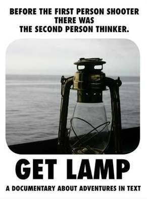
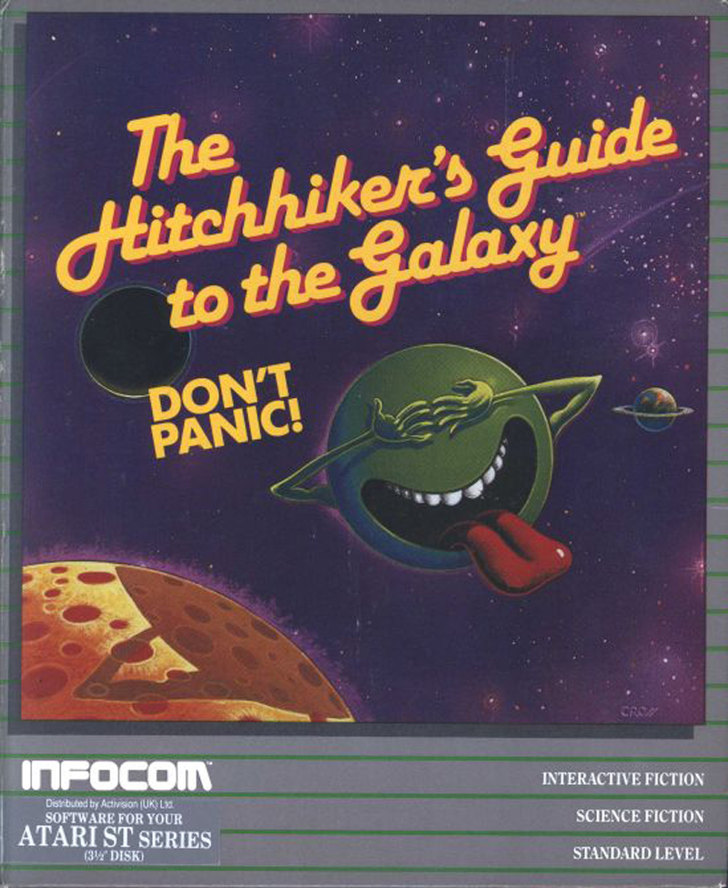

I finally got around to watching Get Lamp which I've been meaning to do for a while now.

It's an interesting documentary though it clearly shows it's low budget nature (it could seriously use a narrator) and I can't imagine it would have the appeal outside of the gaming community that something like King of Kong had.

I think the most interesting element of it for me was just being reminded of how much I enjoyed those games in my childhood. I'm probably amongst the first generation where video games really were ubiquitous. The first game I really played extensively was Super Mario Bros so unlike the guys who got into gaming in the late 70's graphics was always an option even at home.

My real introduction to text adventures (apparently you call them IF now) was Hitchhikers Guide. Long after such things had fallen by the wayside I was a huge Adams fan and sunk hours into playing [this impenetrable monster of a game](http://www.douglasadams.com/creations/infocomjava.html) into which the great man had clearly invested a significant amount of time.

Straight after watching the film I went to [the competition site mentioned in the film](http://ifcomp.org/) and played a few of the high ranking games. Despite all the intervening years I fell right back into the joy of the genre.

As inevitably happens in such situations it has awakened in me a long held desire to write a text adventure. I have always felt that there was a novel in me somewhere, but all of my past literary projects have come to nothing and so I have largely restricted myself to non fiction writing in the past few years. A text adventure would I think tickle that part of my brain which enjoys coding as well as the more creative part.

Part of the appeal is discovering that Inform 7 one of the principle development tools used for writing these games uses a [declarative](http://en.wikipedia.org/wiki/Declarative_programming) domain specific language based on a natural language like syntax. I learned [Prolog](http://en.wikipedia.org/wiki/Prolog) at university and found it quite an interesting approach to programming (if painful at times). The first thing you learn on a Comp Sci degree is that we have programming languages because attempting to write programs in natural language would be a non starter. The large number of Inform 7 games would seem to suggest that for specific application and a narrow definition of &#8220;natural language&#8221; this may not be the case. Software engineers tend to be so focussed on the default OO/procedural approach to software design that it's easy to forget that any other paradigm can exist and I'm sure the experience would [sharpen my saw](http://www.codinghorror.com/blog/2009/03/sharpening-the-saw.html).

As anyone who knows me about 1 in 10 of my projects comes to fruition so don't hold your breath waiting for a dazzling piece of interactive fiction to appear on here unless you are interested in free diving, or experimenting with the properties of your vagus nerve.