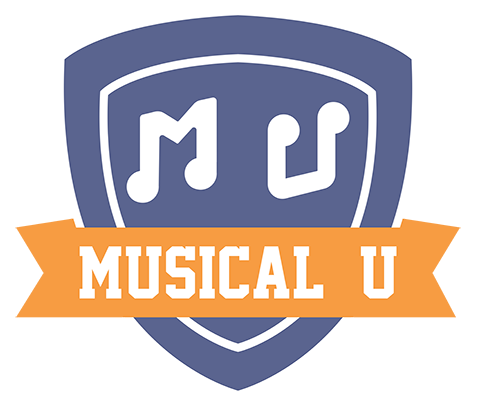

I finally found some time to update my janky looking Word Press to a shiny new Gatsby powered site. 
I’ll write about why I wanted to change and what made me select Gatsby at some point in the future, but in this post I want to reflect on the history of my blog.

## Looking Back
This blog has existed in one form or another since 2006 and looking back provided me with some interesting insights. In 2018 the idea of even having a blog (and especially self hosted) seems somewhat retrograde, but back in 2006 when social media still meant MySpace blogging was what you did if you wanted a simple way to share things with people over the internet. I'm impressed how dedicated I was that I managed to sustain posting several times a month for so long.

I've been a blogger since there only were a few thousand bloggers in the world first on Open Diary and then on Live Journal (alas the teenage insight on those pages is lost to the mists of time). This page started life on [Blogger](http://monquixote.blogspot.co.uk/) before I was tempted away to Posterous. That site was promptly shut down after being bought out (I wrote about my disappointment with free services that shut down [here](/when-cheap-is-better-than-free/) ). After that experience I decided to be the master of my own destiny and self host however since the move to Word Press I've managed the grand total of five posts in five years. Partially this is due to the increasing demands on my time from having a family and because in the era of Facebook people are seldom interested in your blog, but also because I have found other outlets for my writing with a bit more reach.

## What have I been up to?

From 2011 I began writing for Easy Ear Training which has since morphed into the excellent [Musical U](https://www.musical-u.com). This gave me a great opportunity to take writing more seriously and the quality of my written output massively improved over this period. You can find all of my collected writing for Musical U [here.](https://www.musical-u.com/learn/author/nick-long/)

In addition to Musical U in 2013 I helped to set up [The Fretboard](http://www.thefretboard.co.uk/) which is now the UKs most popular guitar site. since then I've spent most of my writing energy on contributing to the community. 

## Looking to the future
Modernising my site doesn't mean I've recommitted to blogging and the original focus of game and music reviews feels a bit like "Dancing about architecture" in a world where streaming services exist. 
That said I don't intent to leave it entirely unloved. I would like to use it as a platform to share projects that I've been working on, but this will be intentionally infrequent.